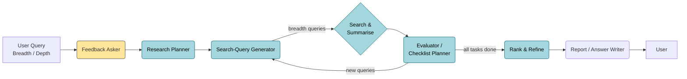

# Deep Research Agent — Product Requirements Document

---

## 1. Purpose

Design and implement a multi-step web-research agent that can autonomously break down an arbitrary research question, gather evidence from the open web, and produce a citation-rich Markdown report (or concise answer).  
The agent should balance **depth** (iterative exploration) with **cost / latency** by maintaining a compact planning state rather than keeping every page in the LLM context window.

---

## 1-A. High-Level Loop (at a glance)



_Purple arrows (not shown) represent internal SERP calls & page fetches executed in parallel._

### 1-B. Textual Flow Diagram (end-to-end)

```
USER QUERY  (breadth, depth)
  │
  ├─► Optional Feedback Asker [B]
  │      • Clarifies vague prompts / collects follow-up info
  │
  └─► Research Planner / Checklist Builder [C]
          • Produces free-form plan + JSON checklist
          │
          └─► Search-Query Generator  (≤ breadth queries) [D]
                  │
                  └─►  For each query (PARALLEL):
                          Search Agent  ⇢  Page Summariser [E]
                                • SERP → URLs → page fetch → 300-500 tok summary
                  ▼
          Evidence Pool  (all page summaries)
          │
          └─► Evaluator & Checklist Planner [F]
                  • Compare evidence ↔ checklist goals
                  • Update task status, spot gaps
                  • Emit follow-up queries  (if depth_left > 0)
                  │
                  ├─► New queries?  → back to Search-Query Generator
                  └─► All tasks done  ∨  depth exhausted
                           │
                           ▼
                  Rank & Refine [G]
                       • Select top-N summaries to fit context budget
                           │
                           ▼
                  Report / Answer Writer [H]
                       • Generate Markdown report or concise answer
                           │
                           ▼
                       USER OUTPUT
```

---

## 2. Success Criteria

| Metric                                               | Target             |
| ---------------------------------------------------- | ------------------ |
| Factual accuracy (manual spot-check)                 | ≥ 90 %             |
| Percentage of sources with working links             | ≥ 95 %             |
| Average tokens per full run (breadth = 4, depth = 2) | ≤ 300 k│API tokens |
| End-to-end latency (same run)                        | ≤ 4 min            |
| User rating (thumbs-up) in CLI/API                   | ≥ 4 / 5            |

---

## 3. Key Concepts & Glossary

- **Breadth** — number of search queries issued per iteration.
- **Depth** — maximum recursion levels; each level may generate new queries.
- **Research Plan / Checklist** — JSON array of sub-tasks the agent must satisfy.
- **Page Summary** — 300-500-token distilled view of a single web page.
- **Planner LLM** — long-context reasoning model that owns the checklist.
- **Browser Worker** — sub-agent that fetches a page and returns a Page Summary.

---

## 4. Component Catalogue (Role · Inputs · Outputs)

| ID    | Component                         | Role                                                                                                                                 | Key Inputs                                            | Key Outputs                               |
| ----- | --------------------------------- | ------------------------------------------------------------------------------------------------------------------------------------ | ----------------------------------------------------- | ----------------------------------------- |
| **B** | **Feedback Asker** _(optional)_   | Clarify vague prompts before research starts.                                                                                        | `user_query`                                          | `follow_up_questions` · `combined_prompt` |
| **C** | **Research Planner**              | Decompose prompt into a free-form plan **plus** JSON checklist of `SubTask`s.                                                        | `combined_prompt` · `depth` · `breadth`               | `plan_text` · `checklist` (init)          |
| **D** | **Search-Query Generator**        | Convert the plan (or updated checklist) into ≤ `breadth` focused search queries.                                                     | `plan_text` · `breadth`                               | `queries[]`                               |
| **E** | **Search & Summarise**            | (a) Run SERP, (b) fetch pages with Steel `/scrape`, (c) distil each page into configurable-length **RefinedContent**.                | `queries[]`, `summaryTokens` (default 500)            | `RefinedContent[]`                        |
| **F** | **Evaluator / Checklist-Planner** | Analyse the collected page summaries, update checklist, emit follow-up queries if gaps remain.                                       | `checklist` (prev) · `pageSummaries[]` · `depth_left` | `checklist` (updated) · `new_queries[]`   |
| **G** | **Rank & Refine**                 | Pick the top-N page summaries to fit within context budget.                                                                          | `checklist` (final) · `pageSummaries[]`               | `filtered_summaries[]`                    |
| **H** | **Report / Answer Writer**        | Generate the final deliverable from filtered summaries. _Report structure is flexible — narrative sections determined by the model._ | `filtered_summaries[]` · `combined_prompt`            | `markdown_report` **or** `exact_answer`   |

> `summaryTokens` is configurable (CLI flag / API param) with default `500`.

### 4-B. Expanded Component Specifications

| ID           | Code Class / Module                                                    | Detailed Responsibilities                                                                                                                                                            | Key Inputs                                                   | Key Outputs                                      |
| ------------ | ---------------------------------------------------------------------- | ------------------------------------------------------------------------------------------------------------------------------------------------------------------------------------ | ------------------------------------------------------------ | ------------------------------------------------ |
| B            | (planned) — will be a light wrapper around CLI/HTTP layer              | • Detect ambiguity in `user_query`.<br>• Ask clarifying questions.<br>• Merge answers back into `combined_prompt`.                                                                   | `user_query`                                                 | `follow_up_text`, `combined_prompt`              |
| C            | `QueryPlanner` (`src/agents/QueryPlanner.ts`)                          | • Generate free-form strategic plan.<br>• Extract structured sub-queries (breadth).<br>• Maintain checklist JSON.<br>• On refinement: merge learnings & gaps into new plan.          | `combined_prompt`, `depth`, `breadth`, `researchDirections?` | `ResearchPlan` (plan text + structured queries)  |
| D            | (part of `QueryPlanner`)                                               | • Serialize ≤ breadth queries for current iteration.                                                                                                                                 | `ResearchPlan.subQueries`                                    | `query[]` strings                                |
| E            | `SearchAgent` (`src/agents/SearchAgent.ts`) + internal browser workers | • Execute SERP via Steel/Google.<br>• For each URL: scrape & normalise content.<br>• Trim to first 25 k chars, summarise to 300-500 tok.<br>• Emit `SearchResult[]`.                 | `query`, SERP options                                        | `SearchResult[]` (title, url, content, summary)  |
| F            | `ContentEvaluator` (`src/agents/ContentEvaluator.ts`)                  | • Extract structured `Learning[]` from summaries.<br>• Score coverage & quality.<br>• Propose `ResearchDirection[]` and completeness assessment.                                     | `SearchResult[]`, `ResearchPlan`, depth context              | `ResearchEvaluation`                             |
|              | `ContentRefiner` (`src/agents/ContentRefiner.ts`)                      | • Decide to continue / refine / terminate.<br>• Generate strategic guidance for next iteration.<br>• Interface with Planner for next plan.                                           | `ResearchEvaluation`, accumulated learnings & queries        | `RefinementDecision` (continue? new directions?) |
| G            | `ContentRefiner` (ranking path)                                        | • When terminating loop, rank summaries by relevance, novelty, authority.<br>• Return top-N (`max_sources`) for writer.                                                              | `SearchResult[]`, checklist                                  | `filtered_summaries[]`                           |
| H            | `ReportSynthesizer` (`src/agents/ReportSynthesizer.ts`)                | • Organise learnings by type.<br>• Stream long-form Markdown (Intro → Findings → Conclusion).<br>• Inject inline citations, produce `Citation[]` list.<br>• Return `ResearchReport`. | `filtered_summaries[]`, `Learning[]`, original query         | `ResearchReport`                                 |
| Orchestrator | `DeepResearchAgent` (`src/core/DeepResearchAgent.ts`)                  | • Glue code: instantiates all agents.<br>• Manages depth/breadth loop, deduping, retries.<br>• Emits rich event stream (`tool-call-*`, `research-progress`, etc).                    | User input, config                                           | Final report, event stream                       |

**Cross-cutting concerns**

- **ProviderManager** (`src/providers/providers.ts`) — centralises AI & Steel clients.
- **EventFactory / events.ts** — uniform event objects for real-time UIs & logs.
- **utils/logger.ts** — pluggable logging with log-levels.
- **Error Handling & Retries** — implemented in each agent; orchestrator escalates critical errors.

---

## 5. Functional Requirements

### 5.1 Input

```jsonc
{
  "query": "string – user question",
  "breadth": 2-10,
  "depth":   1-5,
  "mode":   "report" | "answer",
  "summaryTokens": 100-1000, // default 500 (optional)
  "followUpDialogue": [      // optional two-turn clarification
    {
      "system": "string – system message before clarification",
      "assistant": "string – model question",
      "user": "string – user clarification"
    }
  ]
}
```

### 5.2 Output (`mode == report`)

- `markdown` — ≥ 3 sections: Intro • Findings • Conclusion
- `sources[]` — ordered list of distinct URLs

### 5.3 Output (`mode == answer`)

- `answer` — ≤ 140 characters
- `sources[]`

### 5.4 Core Loop

1. **Research-Planner** decomposes the prompt into a checklist of sub-tasks (`status: "todo"`).
2. For each iteration **while depth > 0 & unfinished tasks exist**:
   1. Planner selects one **todo** task ➜ drafts ≤ breadth search queries.
   2. For each query:
      - Call SERP via **SearchAgent** → top N urls (N≤5).
      - **SearchAgent** fetches each url with Steel's `/scrape` endpoint (parallel, rate-limited) and returns **RefinedContent** (title, url, _≤ `summaryTokens`_ tokens, default 500).
   3. Planner attaches summaries, updates task status (`done` / `in_progress`).
3. When all tasks `done` **or** depth == 0 ➜ generate report/answer.

> `summaryTokens` is configurable (CLI flag / API param) with default `500`.

### 5.5 Error & Retry

- Timeouts or HTTP 4xx → skip url and log.
- If no evidence collected for a task in a depth level → mark task as `blocked`; planner may re-issue broader queries next level.

---

## 6. Non-Functional Requirements

- **Token discipline:** never exceed model context; use `trimPrompt()` on large pages.
- **Cost guardrails:** global concurrency limit via `FIRECRAWL_CONCURRENCY` env.
- **Observability:** log per-task timings, token counts, LLM costs.
- **Extensibility:** swapping SERP provider or model via env vars.

---

## 7. Architecture Snapshot

```mermaid
flowchart TD
  User --> API
  API --> Planner[Research Planner LLM]
  Planner -->|search queries| Search[SearchAgent]
  Search -->|RefinedContent[]| Planner
  Planner -->|Checklist done| Writer[Report Writer LLM]
  Writer --> API
  API --> User
```

---

## 8. Interfaces

### 8.1 Planner ↔️ Browser Worker contract

```jsonc
{
  "url": "…",
  "task": "Find qualifying marks for D2/D3 divisions"
}
```

Browser Worker returns:

```jsonc
{
  "url": "…",
  "title": "…",
  "summary": "300-500 token page summary"
}
```

---

## 9. Milestones

| Week | Deliverable                                      |
| ---- | ------------------------------------------------ |
| 1    | PRD sign-off; test harness for SERP + page fetch |
| 2-3  | Checklist-based planner (no persistence)         |
| 4    | Browser Worker & summary logging                 |
| 5    | Report/Answer writer integration                 |
| 6    | CLI & API polishing; metrics dashboard           |
| 7    | Beta release; collect user feedback              |

---

## 10. Open Questions / Risks

1. How to rank pages when multiple tasks fetch the same url?
2. Citation granularity — per sentence vs. per section.
3. Scaling beyond public web (PDFs, paywalled content?)

---

### 8. Prompts & Configuration

All prompt templates live in **`src/prompts/prompts.ts`**. They are imported by agents via:

```ts
import { prompts } from "../prompts/prompts";
```

This single module centralises:

- `planningPrompt`
- `summaryPrompt`
- `evaluationPrompt`
- `reportPrompt`
- any helper system messages.

---

_Revision 0.1 — 2025-07-14_
