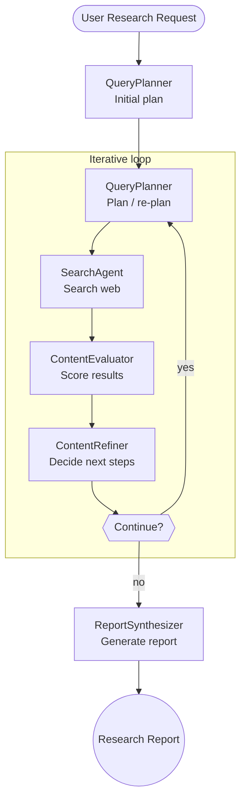

# Deep Research Agent Workflow with Steel

> Autonomous, agent workflow that plans, searches, evaluates and synthesizes information – so you can build deep research into your apps.

---

## Why this exists

Developers keep hearing about “**Deep Research**” from papers, blog posts and recent demos by [OpenAI](https://openai.com/index/introducing-deep-research/) and [Google Gemini](https://gemini.google/overview/deep-research/?hl=en-CA). But there’s little open-source code that shows _how_ to wire the planning–search–evaluate–synthesis loop together.

This project is **a reference implementation** – a starting point you can:

- **Read**: the code is small, idiomatic TypeScript, heavily commented.
- **Fork & customise**: swap providers, tweak prompts, add new agents.
- **Drop in**: import the orchestrator and embed deep research into your own bot or backend today.

All built on top of **[Steel](https://steel.dev)** for reliable browsing / scraping, with a liberal MIT license.

---

## Tech stack at a glance

| Layer              | What we use                                                         | Why                                             |
| ------------------ | ------------------------------------------------------------------- | ----------------------------------------------- |
| Runtime            | **Node.js 18+** + **TypeScript 5**                                  | Modern, type-safe, ubiquitous                   |
| Browser / scraping | **Steel SDK**                                                       | Headless, persistent, production-grade sessions |
| LLM providers      | **OpenAI**, **Anthropic**, **TogetherAI** via `ai` SDK              | Toggle models with a config change              |
| Validation         | `zod`                                                               | Runtime type safety for API payloads            |
| Events             | Node.js `EventEmitter` + custom TypeScript types                    | Real-time, strongly-typed hooks                 |
| CLI UX             | `commander`, `inquirer`, `ora`, `chalk`, `gradient-string`, `boxen` | Pretty terminal out-of-the-box                  |
| Tests              | Plain `ts-node` tests (can migrate to Vitest/Jest)                  | Ensure each agent behaves                       |

_You can replace any layer (e.g. use LangChain, a different scraper, or a local model) without touching the orchestrator logic._

---

## How it works



_All agents emit rich events (`tool-call`, `progress`, `text`, …) so you can stream updates or build visual dashboards._

---

## Quick start

```bash
# 1. Install dependencies
pnpm i   # or npm install / yarn

# 2. Copy the example env and add your keys
cp .env.example .env
$EDITOR .env  # ➜ add OPENAI_API_KEY, STEEL_API_KEY, etc.

# 3. Run the CLI
node dist/cli.js "What are the most promising battery technologies for EVs?" \
  --depth 3 --breadth 5
```

### Programmatic usage

```ts
import { DeepResearchAgent } from "@steel-cookbook/deep-research";
import { loadConfig } from "@steel-cookbook/deep-research/dist/config";

const config = loadConfig();
const agent = new DeepResearchAgent(config);

// Listen for fancy events
agent.on("progress", (p) => console.log(p));
agent.on("tool-call", (t) => console.log(t.toolName, t.input));

const report = await agent.research(
  "What is the current state of quantum-safe cryptography?",
  { depth: 3, breadth: 5 }
);

console.log(report.executiveSummary);
```

---

## Event API

Hook into the agent’s `EventEmitter` to build live dashboards, drive UIs or log telemetry.

### Convenience events (back-compat)

| Event         | When it fires                                               | One-liner                                              |
| ------------- | ----------------------------------------------------------- | ------------------------------------------------------ |
| `progress`    | Overall progress updates `{ phase, progress, currentStep }` | `agent.on("progress", p => console.log(p.progress))`   |
| `tool-call`   | A tool starts (e.g. `search`, `scrape`, `analyze`)          | `agent.on("tool-call", t => console.log(t.toolName))`  |
| `tool-result` | A tool finishes (success/FAIL)                              | `agent.on("tool-result", r => console.log(r.success))` |
| `text`        | Streamed text chunks (strategic plans, commentary)          | `agent.on("text", txt => process.stdout.write(txt))`   |
| `error`       | Any uncaught error within the agent loop                    | `agent.on("error", err => console.error(err))`         |
| `done`        | Final `ResearchReport` emitted                              | `agent.on("done", rep => saveReport(rep))`             |

These map internally to richer **structured events** shown below; they’re kept for easy migration from earlier versions.

### Structured events (AI-SDK v5 style)

| Event type               | Purpose                                                                | Tiny hook                                                       |
| ------------------------ | ---------------------------------------------------------------------- | --------------------------------------------------------------- |
| `tool-call-start`        | Tool invocation begins – payload has `toolName`, `input`, `toolCallId` | `agent.on('tool-call-start', e => console.log(e.toolName))`     |
| `tool-call-progress`     | Optional granular progress inside a long-running tool                  | `agent.on('tool-call-progress', e => console.log(e.progress))`  |
| `tool-call-end`          | Tool completes – includes `success`, `output`, `error`, `duration`     | `agent.on('tool-call-end', e => console.log(e.success))`        |
| `research-progress`      | Phase-level progress across the entire loop                            | `agent.on('research-progress', e => console.log(e.phase))`      |
| `text-stream`            | Incremental content from planning / analysis / synthesis               | `agent.on('text-stream', e => process.stdout.write(e.content))` |
| `research-milestone`     | High-level checkpoints (plan created, report generated, …)             | `agent.on('research-milestone', e => console.log(e.milestone))` |
| `research-error`         | Structured error with `phase`, `recoverable` flag                      | `agent.on('research-error', e => console.error(e.error))`       |
| `research-session-start` | New research session begins (contains `query`, `options`)              | `agent.on('research-session-start', e => console.log(e.query))` |
| `research-session-end`   | Session finishes – carries the final `result`                          | `agent.on('research-session-end', e => console.log('done'))`    |

> All structured events share `{ id, sessionId, timestamp, type }` and optional `metadata` for easy correlation.

---

## Configuration

All settings live in `src/config.ts` (or `steel.config.*`). You can tweak:

- **AI provider & model** (`openai`, `anthropic`, `together`, …)
- **Search provider** (Steel, SerpAPI, browserless)
- Research **depth/breadth/timeouts**
- Whether to include **images** or force **human-in-the-loop** approval

Environment variables override config files. See `.env.example` for the full list.

---

## Project structure (selected)

```
src/
  agents/           # Specialized single-responsibility agents
  core/             # Orchestrator, events & interfaces
  utils/            # Helpers (logger, contentProcessor, …)
  prompts/          # Few-shot & chain-of-thought prompts
  cli.ts            # Charming terminal UI built with commander + ora
```

---

## Extending / contributing

1. Fork the repo and create a feature branch.
2. Add tests next to the modules you touch (`*.test.ts`).
3. Run `pnpm test` – **100 % pass** is required.
4. Submit a PR → get feedback, iterate, celebrate.

We welcome new search providers, evaluation strategies, UI integrations – or just better docs!

---

## License

MIT © Steel Dev – Happy researching!
